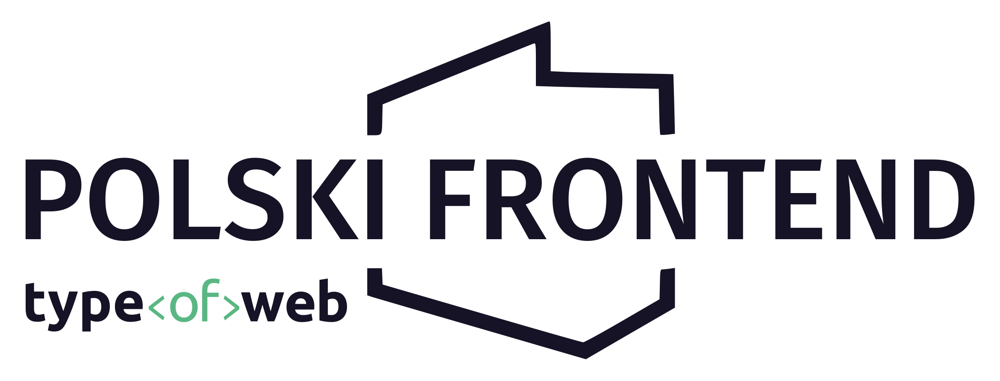

 
  
   
   
   

<!-- ALL-CONTRIBUTORS-BADGE:START - Do not remove or modify this section -->

<!-- ALL-CONTRIBUTORS-BADGE:END -->

## Dev

Zachęcamy do tworzenia issues i pracy z kodem! Otwórz [CONTRIBUTING](./CONTRIBUTING.md).

## Społeczność ✨

Ogromne podziękowania dla tych fantastycznych osób ([wyjaśnienie emoji](https://allcontributors.org/docs/en/emoji-key)):

<!-- ALL-CONTRIBUTORS-LIST:START - Do not remove or modify this section -->
<!-- prettier-ignore-start -->
<!-- markdownlint-disable -->
<table>
  <tr>
    <td align="center"><a href="https://nafrontendzie.pl/"> <b>Bartłomiej Dybowski</b></a> <a href="https://github.com/typeofweb/polskifrontend/commits?author=burczu" title="Code">💻</a> <a href="#ideas-burczu" title="Ideas, Planning, & Feedback">🤔</a></td>
    <td align="center"><a href="https://typeofweb.com/"> <b>Michał Miszczyszyn</b></a> <a href="https://github.com/typeofweb/polskifrontend/commits?author=mmiszy" title="Code">💻</a> <a href="#maintenance-mmiszy" title="Maintenance">🚧</a> <a href="#projectManagement-mmiszy" title="Project Management">📆</a> <a href="https://github.com/typeofweb/polskifrontend/pulls?q=is%3Apr+reviewed-by%3Ammiszy" title="Reviewed Pull Requests">👀</a></td>
    <td align="center"><a href="https://github.com/drillprop"> <b>Bartosz Dryl</b></a> <a href="https://github.com/typeofweb/polskifrontend/commits?author=drillprop" title="Code">💻</a> <a href="https://github.com/typeofweb/polskifrontend/pulls?q=is%3Apr+reviewed-by%3Adrillprop" title="Reviewed Pull Requests">👀</a></td>
  </tr>
  <tr>
    <td align="center"><a href="https://jb1905.github.io/portfolio/"> <b>Jakub Biesiada</b></a> <a href="https://github.com/typeofweb/polskifrontend/commits?author=JB1905" title="Code">💻</a></td>
    <td align="center"><a href="https://github.com/AdamSiekierski"> <b>Adam Siekierski</b></a> <a href="https://github.com/typeofweb/polskifrontend/commits?author=AdamSiekierski" title="Code">💻</a> <a href="https://github.com/typeofweb/polskifrontend/pulls?q=is%3Apr+reviewed-by%3AAdamSiekierski" title="Reviewed Pull Requests">👀</a></td>
    <td align="center"><a href="https://github.com/nanoDW"> <b>nanoDW</b></a> <a href="https://github.com/typeofweb/polskifrontend/pulls?q=is%3Apr+reviewed-by%3AnanoDW" title="Reviewed Pull Requests">👀</a></td>
  </tr>
  <tr>
    <td align="center"><a href="https://github.com/takatejr"> <b>takatejr</b></a> <a href="https://github.com/typeofweb/polskifrontend/pulls?q=is%3Apr+reviewed-by%3Atakatejr" title="Reviewed Pull Requests">👀</a></td>
    <td align="center"><a href="https://github.com/wisnie"> <b>Bartłomiej Wiśniewski</b></a> <a href="https://github.com/typeofweb/polskifrontend/commits?author=wisnie" title="Code">💻</a> <a href="https://github.com/typeofweb/polskifrontend/pulls?q=is%3Apr+reviewed-by%3Awisnie" title="Reviewed Pull Requests">👀</a></td>
    <td align="center"><a href="https://www.linkedin.com/in/adam-klepacz/"> <b>Adam Klepacz</b></a> <a href="https://github.com/typeofweb/polskifrontend/commits?author=adamklepacz" title="Code">💻</a></td>
  </tr>
  <tr>
    <td align="center"><a href="https://github.com/poulch"> <b>poulch</b></a> <a href="https://github.com/typeofweb/polskifrontend/pulls?q=is%3Apr+reviewed-by%3Apoulch" title="Reviewed Pull Requests">👀</a> <a href="https://github.com/typeofweb/polskifrontend/commits?author=poulch" title="Code">💻</a></td>
    <td align="center"><a href="https://mateuszromek.pl/"> <b>Mateusz Romek</b></a> <a href="https://github.com/typeofweb/polskifrontend/commits?author=MateuszRomek" title="Code">💻</a></td>
    <td align="center"><a href="http://pabich.cc"> <b>Wiktor Pabich</b></a> <a href="https://github.com/typeofweb/polskifrontend/commits?author=pabichw" title="Code">💻</a></td>
  </tr>
  <tr>
    <td align="center"><a href="http://szery.net.pl"> <b>Łukasz Wiśniewski</b></a> <a href="https://github.com/typeofweb/polskifrontend/commits?author=lukaszwisniewski88" title="Code">💻</a></td>
    <td align="center"><a href="https://github.com/PatrykBuniX"> <b>Patryk Górka</b></a> <a href="https://github.com/typeofweb/polskifrontend/commits?author=PatrykBuniX" title="Documentation">📖</a></td>
    <td align="center"><a href="https://jcubic.pl/me"> <b>Jakub T. Jankiewicz</b></a> <a href="https://github.com/typeofweb/polskifrontend/issues?q=author%3Ajcubic" title="Bug reports">🐛</a></td>
  </tr>
  <tr>
    <td align="center"><a href="https://devszczepaniak.pl/"> <b>Dominik Szczepaniak</b></a> <a href="https://github.com/typeofweb/polskifrontend/issues?q=author%3Aelszczepano" title="Bug reports">🐛</a></td>
    <td align="center"><a href="https://github.com/Wojtazzzz"> <b>Marcin Witas</b></a> <a href="https://github.com/typeofweb/polskifrontend/commits?author=Wojtazzzz" title="Code">💻</a></td>
  </tr>
</table>

<!-- markdownlint-restore -->
<!-- prettier-ignore-end -->

<!-- ALL-CONTRIBUTORS-LIST:END -->

Projekt korzysta ze specyfikacji [all-contributors](https://github.com/all-contributors/all-contributors).
